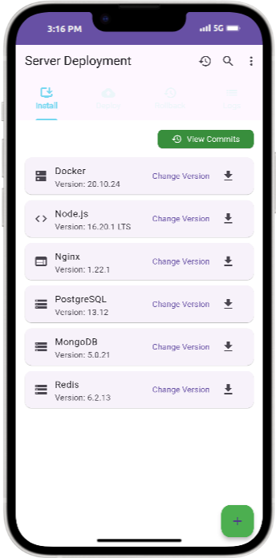
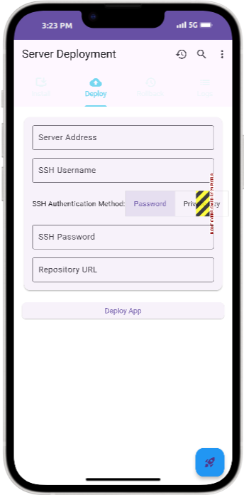
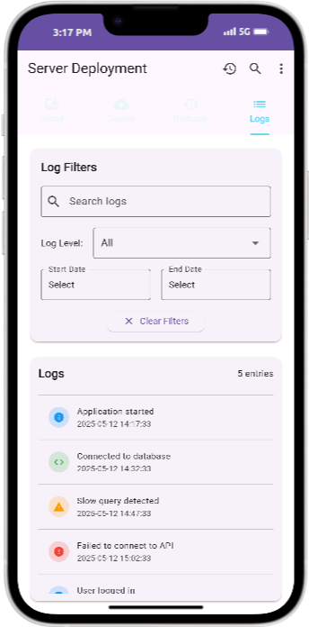
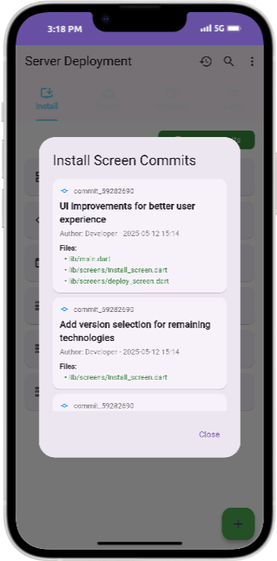

# Server Deployment Mobile App UI Only

A Flutter mobile application for managing server deployments and infrastructure. This app provides a user-friendly interface for installing server applications, deploying code, managing rollbacks, and viewing server logs.

## Features

### 💻 Install Server Applications

Easily install various server technologies with version selection:
- Docker
- Node.js
- Nginx
- PostgreSQL
- MongoDB
- Redis



### 🚀 Deploy Applications

Deploy applications to your server with flexible SSH authentication options:
- Server connection details
- SSH authentication with password or private key
- Repository URL configuration



### 🔄 Version Rollback

Manage application versions and easily roll back to previous versions when needed.

### 📋 Server Logs

View and filter server logs to monitor your applications.



### 📝 Git Commit History

Track changes to your infrastructure with a comprehensive commit history.



## Getting Started

### Prerequisites

- Flutter 3.7.2 or higher
- Dart SDK
- Android Studio or VS Code with Flutter extensions

### Installation

1. Clone this repository:
   ```
   git clone https://github.com/yourusername/server-deployment-app.git
   ```

2. Navigate to the project directory:
   ```
   cd server-deployment-app
   ```

3. Install dependencies:
   ```
   flutter pub get
   ```

4. Run the app:
   ```
   flutter run
   ```

## Architecture

The app is organized using a feature-based structure:

```
lib/
├── main.dart             # Main application entry point
├── router.dart           # Navigation router
├── screens/              # Feature screens
│   ├── install_screen.dart
│   ├── deploy_screen.dart
│   ├── rollback_screen.dart
│   └── logs_screen.dart
└── utils/               # Utility classes
    └── git_service.dart  # Git commit history service
```

## Dependencies

- `file_picker`: For selecting SSH private key files
- Flutter standard libraries

## Contributing

1. Fork the repository
2. Create a feature branch: `git checkout -b feature/your-feature-name`
3. Commit your changes: `git commit -am 'Add some feature'`
4. Push to the branch: `git push origin feature/your-feature-name`
5. Submit a pull request

## License

This project is licensed under the MIT License - see the LICENSE file for details.

## Acknowledgments

- Flutter team for the amazing framework
- Contributors to this project
